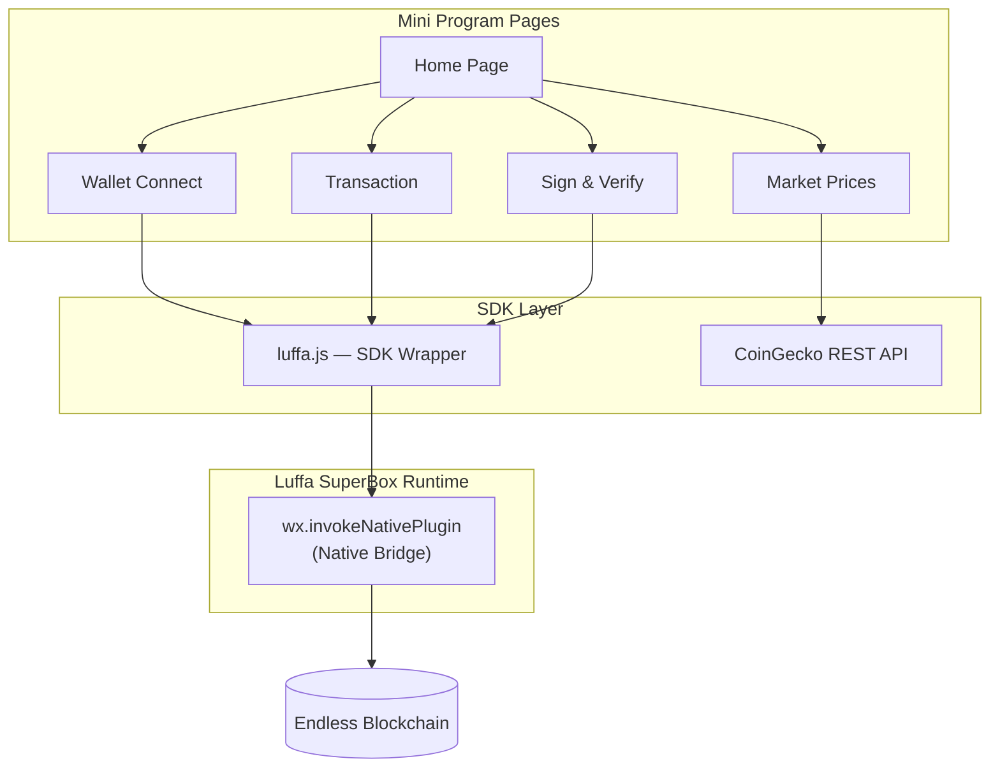
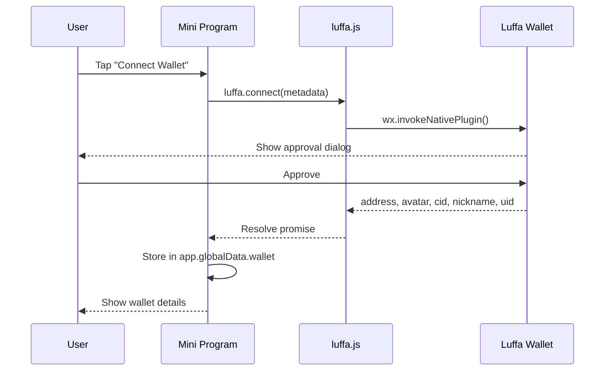
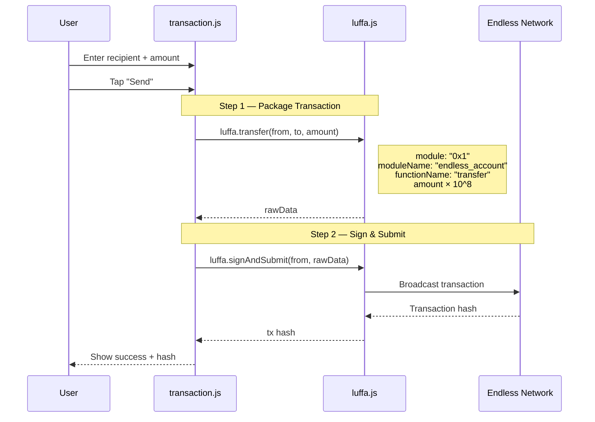
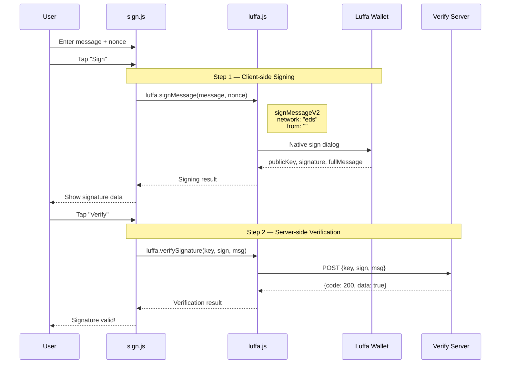
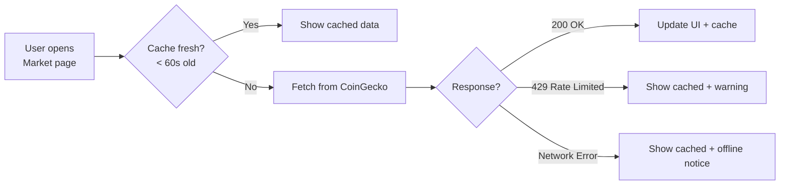

# Luffa x Encode AI Hackathon Template

A ready-to-use **Luffa SuperBox mini program** template that demonstrates core blockchain capabilities on the Endless network. Built for developers participating in the **Encode AI Hackathon**.

## Features

- **Wallet Connect** — Link a Luffa wallet and display address, avatar, nickname
- **EDS Transfer** — Send EDS tokens between wallets on the Endless network
- **Sign & Verify** — Sign messages client-side and verify signatures server-side
- **Live Market Prices** — Real-time crypto prices via CoinGecko API (BTC, ETH, SOL, DOGE)

---

## Architecture



---

## Project Structure

```
LuffaShowCase/
├── app.js                  # App entry — restores wallet from storage
├── app.json                # Page routes & navigation bar config
├── app.wxss                # Global styles
├── project.config.json     # Luffa DevTools config (v2.3.3)
├── luffalogo.svg           # Luffa brand logo
│
├── utils/
│   └── luffa.js            # SDK wrapper — all Luffa native API calls
│
└── pages/
    ├── home/               # Landing page with wallet status & quick actions
    │   ├── home.js
    │   ├── home.wxml
    │   ├── home.wxss
    │   └── home.json
    │
    ├── wallet/
    │   ├── connect.*       # Wallet connect/disconnect
    │   ├── transaction.*   # EDS token transfer
    │   └── sign.*          # Message signing & verification
    │
    └── market/
        ├── market.js       # CoinGecko API with caching
        ├── market.wxml
        ├── market.wxss
        └── market.json
```

---

## Core Flows

### Wallet Connect



### EDS Transfer (2-step)



### Sign & Verify (2-step)



### Market Data Flow



---

## SDK Reference (`utils/luffa.js`)

All functions return **Promises** and use `wx.invokeNativePlugin` with `api_name: "luffaWebRequest"`.

| Function | Description | Key Params |
|----------|-------------|------------|
| `connect(metadata)` | Open wallet connect dialog | `metadata.url`, `metadata.icon` |
| `signMessage(message, nonce)` | Sign a message (signMessageV2) | `message`: string, `nonce`: number |
| `verifySignature(key, sign, msg)` | Verify signature on server | `key`: publicKey, `sign`: signature |
| `packageTransaction(...)` | Package tx V1 (typed params) | `module`, `moduleName`, `functionName`, `data` |
| `packageTransactionV2(...)` | Package tx V2 (function string) | `func`: `"Addr::Module::Func"` |
| `signAndSubmit(from, rawData)` | Sign and broadcast transaction | `rawData` from packageTransaction |
| `transfer(from, to, amount)` | EDS transfer helper (uses V1) | `amount` in EDS (auto-converts to chain units) |
| `getLanguage()` | Get Luffa app language | — |
| `share(title, detail, imageUrl)` | Share content | `title`, `detail` |
| `openUrl(url)` | Open Luffa URL | `url`: luffa:// link |

### V1 Typed Params Format

Transaction data uses positional typed parameters:

```javascript
{
  "1_address_address": "0xRecipientAddress",  // position 1, type address
  "2_u128_amount": "150000000"                // position 2, type u128
}
```

Pattern: `"position_type_paramName"`

### V2 Function String Format

```javascript
{
  function: "0xContractAddress::ModuleName::FunctionName",
  functionArguments: ["arg1", "arg2"],
  typeArguments: []
}
```

---

## Getting Started

### Prerequisites

- [Luffa SuperBox DevTools](https://luffa.im/SuperBox/docs/en/quickStartGuide/quickStartGuide.html) (v2.3.3+)
- A Luffa wallet for testing

### Setup

1. **Clone the template**
   ```bash
   git clone <your-repo-url>
   ```

2. **Open in Luffa DevTools**
   - Launch Luffa SuperBox DevTools
   - Select "Import Project"
   - Point to the cloned directory

3. **Configure your dApp metadata** in `pages/wallet/connect.js`:
   ```javascript
   luffa.connect({
     url: 'https://your-dapp-url.com',        // Your dApp URL
     icon: 'https://your-dapp-icon.com/icon.png' // Your dApp icon
   })
   ```

4. **Preview** — Click "Preview" in DevTools to test on your phone via the Luffa app

### Testing on Device

Some native features (wallet connect, signing, transactions) require a **real device** — they may not work fully in the DevTools simulator.

---

## API Notes

### CoinGecko (Market Page)

- **Free tier** — no API key required
- **Rate limit** — the template uses 60s caching and 10s refresh cooldown to avoid 429 errors
- Falls back to cached data when offline or rate-limited

### Luffa Verify Endpoint

The signature verification endpoint:
```
POST https://k8s-ingressn-ingressn-f1c0412ab0-63d9d6d0cb58a38c.elb.ap-southeast-1.amazonaws.com/lf16585928939296/verify/endless/verify
```

Request body:
```json
{
  "key": "<publicKey>",
  "sign": "<signature>",
  "msg": "<fullMessage>"
}
```

Response: `{ "code": 200, "data": true }` if valid.

---

## Documentation

- [Luffa SuperBox Quick Start](https://luffa.im/SuperBox/docs/en/quickStartGuide/quickStartGuide.html)
- [Luffa Custom API Reference](https://luffa.im/SuperBox/docs/en/API/customizeAPI.html)
- [CoinGecko API Docs](https://docs.coingecko.com/reference/introduction)

---

## License

MIT — free to use and modify for your hackathon project.
